<!-- ===== NEON SYSTEM HERO ===== -->
<!-- GitHub automatically selects the emerald dark or light hero. -->

<picture>
  <source media="(prefers-color-scheme: dark)" srcset="assets/dark.svg">
  <source media="(prefers-color-scheme: light)" srcset="assets/light.svg">
  
</picture>

<!-- ===== GITHUB STATS ===== -->

<!-- Streak — full width -->
<picture>
  <source media="(prefers-color-scheme: dark)" srcset="https://streak-stats.demolab.com/?user=beingDurgesh&hide_border=true&background=0A0A0A&stroke=10B981&ring=10B981&fire=FF0000&currStreakLabel=F8FAFC&sideLabels=94A3B8&currStreakNum=F8FAFC&sideNums=F8FAFC&dates=94A3B8&title_color=10B981&card_width=1180&v=1" />
  
</picture>

 

<!-- Stats + Top languages — side by side -->
<picture>
  <source media="(prefers-color-scheme: dark)" srcset="https://github-readme-stats-sigma-rosy-28.vercel.app/api?username=beingDurgesh&show_icons=true&count_private=true&include_all_commits=true&hide_rank=true&hide_border=true&title_color=10B981&icon_color=10B981&text_color=F8FAFC&bg_color=0A0A0A&card_width=500" />
  
</picture>
<picture>
  <source media="(prefers-color-scheme: dark)" srcset="https://github-readme-stats-sigma-rosy-28.vercel.app/api/top-langs/?username=beingDurgesh&layout=compact&langs_count=8&hide_border=true&title_color=10B981&text_color=F8FAFC&bg_color=0A0A0A&card_width=500" />
  
</picture>

<!-- ===== CONTRIBUTION SNAKE ===== -->

<picture>
  <source media="(prefers-color-scheme: dark)"
          srcset="https://raw.githubusercontent.com/beingDurgesh/beingDurgesh/output/snake-dark.svg" />

  <source media="(prefers-color-scheme: light)"
          srcset="https://raw.githubusercontent.com/beingDurgesh/beingDurgesh/output/snake-light.svg" />

  
</picture>

<!-- ===== END SNAKE ===== -->

 

<!-- ===== TECH ARSENAL ===== -->

### 🛠️ TECH ARSENAL

<table>
<tr>
<td align="center" width="33%">

**LANGUAGES & FRAMEWORKS**

</td>
<td align="center" width="33%">

**AI & MACHINE LEARNING**

</td>
<td align="center" width="33%">

**Databases & CLOUD**

</td>
</tr>
<tr>
<td align="center" colspan="3">

**TOOLS & PLATFORMS**

</td>
</tr>
</table>

<!-- ===== SOCIAL BADGES ===== -->
 

&nbsp;&nbsp;

&nbsp;&nbsp;

&nbsp;&nbsp;

<!-- ===== END SOCIAL BADGES ===== -->

 

<!-- =================================== -->
